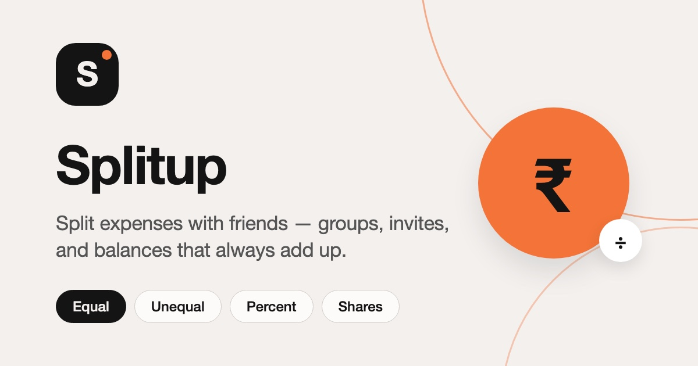
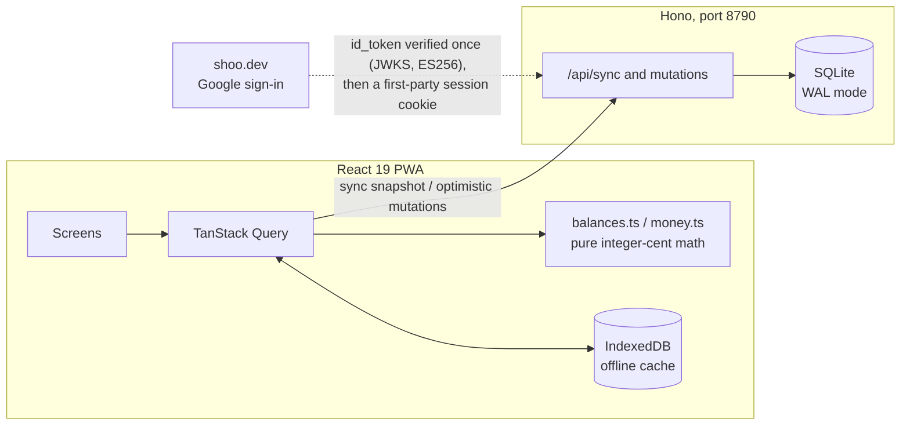

<div align="center">



<br/><br/>

[](https://react.dev)
[](https://www.typescriptlang.org)
[](https://vite.dev)
[](https://tailwindcss.com)
[](https://hono.dev)
[](https://sqlite.org)
[](https://web.dev/progressive-web-apps/)
[](LICENSE)

A self-hosted Splitwise alternative — an installable, offline-capable PWA<br/>for
splitting expenses with friends, built to be safe, precise, and pleasant to use.

**[splitup.sunnydx.dev](https://splitup.sunnydx.dev)**

[Features](#features) · [Architecture](#architecture) · [Getting started](#getting-started) · [Deployment](#deployment) · [Security](#security)

</div>

---

## Features

- **Groups and friends** — multi-user groups with shareable invite links, plus direct friend-to-friend expenses outside any group.
- **Four split modes** — equal, unequal, percent, or shares, with largest-remainder rounding so the cents always add up to the total.
- **Simplified debts** — balances are netted per group and settle-up suggests the minimum set of transfers, so settling through one person never creates phantom debts.
- **Multi-currency** — each group locks its currency; totals are reported per currency, never converted behind your back.
- **Offline-ready** — data is readable offline, installed or in the browser; edits require a connection by design, so there are no stale writes and no conflict surprises.
- **Themes** — light, dark, and AMOLED, system-following, with a view-transition theme toggle.
- **Everyday utilities** — activity feed, CSV export, and payment reminders.
- **Privacy-first authentication** — Google sign-in via [shoo.dev](https://shoo.dev); no passwords stored, no tracking.

## Architecture

A single read endpoint drives the application: `GET /api/sync` returns the caller's
entire visible dataset as one snapshot. Every balance, ledger, and activity view is
derived client-side by pure functions over that snapshot. Money is handled as integer
minor units end to end, so the arithmetic is exact and works offline.



| Package | Stack |
|---------|-------|
| `web/` | React 19, Vite, TypeScript, Tailwind CSS v4, shadcn (base-nova on [Base UI](https://base-ui.com)), TanStack Query, `vite-plugin-pwa` |
| `server/` | [Hono](https://hono.dev), better-sqlite3, `jose`, Zod, executed with `tsx` |

The shoo id_token is verified server-side once (issuer and audience pinned) and
immediately discarded; the application then runs on its own random httpOnly session
cookie, SHA-256 hashed at rest with a 30-day sliding expiry. shoo's `client_id` is
derived from the application origin, so no dashboard or registration is required.

## Getting started

Requires Node.js 20 or later.

```bash
npm install --prefix web
npm install --prefix server
npm install                # root (concurrently)

npm run dev                # API on :8790, web on :5173 (proxies /api to :8790)
```

Open http://localhost:5173. Sign-in is Google-only through shoo.dev; in development
the origin is `http://localhost:5173`.

## Deployment

**Single origin** — the server serves the built web application and the API together:

```bash
npm run build              # builds web/dist
APP_ORIGIN=https://your.domain npm start   # serves web/dist and /api on :8790
```

**Docker** — the included three-stage `Dockerfile` builds the web bundle and runs the
server on port 8790:

```bash
docker build -t splitup .
docker run -d -p 8790:8790 \
  -e APP_ORIGIN=https://your.domain \
  -e DB_PATH=/data/splitup.db \
  -v splitup_data:/data \
  splitup
```

> [!IMPORTANT]
> Mount a volume for the database. SQLite runs in WAL mode — back up the `.db`,
> `.db-wal`, and `.db-shm` files together, or use `sqlite3 ... "VACUUM INTO ..."`.

### Configuration

| Variable | Default | Purpose |
|----------|---------|---------|
| `APP_ORIGIN` | `http://localhost:5173` | shoo JWT audience (`origin:<APP_ORIGIN>`), CSRF origin check, invite-link base |
| `DB_PATH` | `server/data/splitup.db` | SQLite file, created on first run |
| `PORT` | `8790` | API/server port |
| `NODE_ENV` | – | `production` enables Secure cookies, CSP, and static serving of `web/dist` |

## Security

- The shoo id_token is verified server-side against shoo's JWKS (ES256, issuer and audience pinned); the JWT is never stored and never reused.
- Sessions are random 32-byte httpOnly cookies, SHA-256 hashed at rest, with a 30-day sliding expiry.
- CSRF protection requires a custom `X-CSRF` header on every mutation, plus an `Origin` allowlist check.
- Per-session rate limiting (300/min general, 20/min on auth), a 64 KB body cap, and strict CSP and security headers on HTML.
- Every input is Zod-validated, all SQL uses prepared statements, and money is integer minor units end to end.
- Non-members receive `404` (never `403`), so resource existence never leaks.

## Testing

```bash
npm run typecheck          # web and server
npm test                   # money, balance, and CSV logic (Vitest)
```

## Design

The visual system — a warm cream canvas, ink pills, and a single signal orange that is
never a call-to-action color — is documented in [DESIGN.md](DESIGN.md).

## License

Released under the [MIT License](LICENSE).
