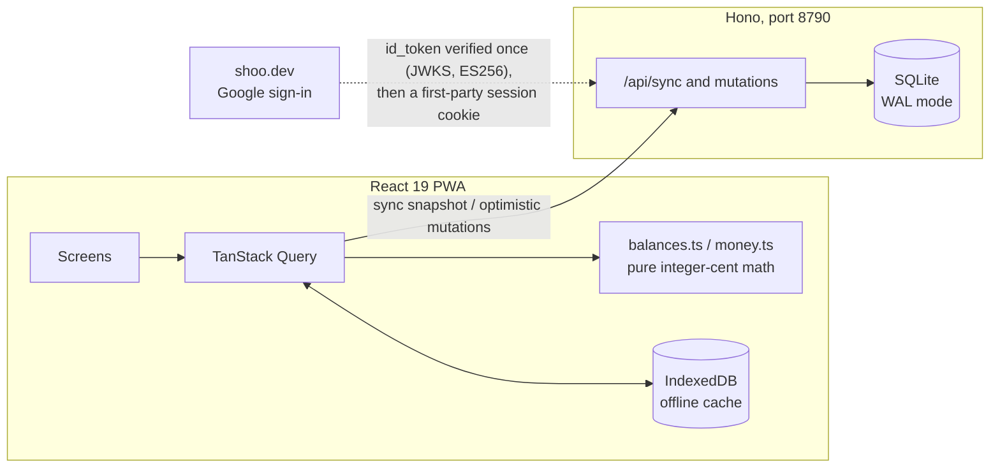

<div align="center">


<br/><br/>

[](https://react.dev)
[](https://www.typescriptlang.org)
[](https://vite.dev)
[](https://tailwindcss.com)
[](https://hono.dev)
[](https://sqlite.org)
[](https://web.dev/progressive-web-apps/)
[](LICENSE)

A self-hosted Splitwise alternative — an installable, offline-capable PWA<br/>for
splitting expenses with friends, built to be safe, precise, and pleasant to use.

**[splitup.sunnydx.dev](https://splitup.sunnydx.dev)**

[Features](#features) · [Architecture](#architecture) · [Getting started](#getting-started) · [Deployment](#deployment) · [Security](#security)

</div>

---

## Features

- **Groups and friends** — multi-user groups with shareable invite links, plus direct friend-to-friend expenses outside any group.
- **Guests** — add people without Splitup to a group by name and track their share; a claim link later moves their balance onto their own account (totals are conserved exactly; suggested transfers may re-route since they order people by account).
- **Four split modes** — equal, unequal, percent, or shares, with largest-remainder rounding so the cents always add up to the total.
- **Simplified debts** — balances are netted per group and settle-up suggests the minimum set of transfers, so settling through one person never creates phantom debts.
- **Multi-currency** — any ISO 4217 currency (searchable picker); each group locks its currency; totals are reported per currency, never converted behind your back.
- **Offline-ready** — data is readable offline, installed or in the browser; edits require a connection by design, so there are no stale writes and no conflict surprises.
- **Themes** — light, dark, and AMOLED, system-following, with a view-transition theme toggle.
- **Everyday utilities** — activity feed, CSV export, and payment reminders.
- **Recurring bills** — rent, utilities and subscriptions repeat weekly, monthly or yearly; each due date lands in a "Due to add" inbox on Home to add (after a review) or skip, never posted on its own. Missed dates are caught up after server downtime.
- **Receipt scanning** (optional) — snap a bill and watch Claude read it: its thinking streams live while the form fills in, the arithmetic is checked in code, and you still review the numbers, pick the split, and save.
- **Privacy-first authentication** — Google sign-in via [shoo.dev](https://shoo.dev); no passwords stored, no tracking.

## Architecture

A single read endpoint drives the application: `GET /api/sync` returns the caller's
entire visible dataset as one snapshot. Every balance, ledger, and activity view is
derived client-side by pure functions over that snapshot. Money is handled as integer
minor units end to end, so the arithmetic is exact and works offline.


```mermaid
flowchart LR
    subgraph client [React 19 PWA]
        UI[Screens] --> Q[TanStack Query]
        Q --> M["balances.ts / money.ts<br/>pure integer-cent math"]
        Q <--> IDB[("IndexedDB<br/>offline cache")]
    end
    subgraph server [Hono, port 8790]
        API["/api/sync and mutations"] --> DB[("SQLite<br/>WAL mode")]
    end
    Q -- "sync snapshot / optimistic mutations" --> API
    SHOO["shoo.dev<br/>Google sign-in"] -. "id_token verified once (JWKS, ES256),<br/>then a first-party session cookie" .-> API
```

| Package | Stack |
|---------|-------|
| `web/` | React 19, Vite, TypeScript, Tailwind CSS v4, shadcn (base-nova on [Base UI](https://base-ui.com)), TanStack Query, `vite-plugin-pwa` |
| `server/` | [Hono](https://hono.dev), better-sqlite3, `jose`, Zod, executed with `tsx` |

The shoo id_token is verified server-side once (issuer and audience pinned) and
immediately discarded; the application then runs on its own random httpOnly session
cookie, SHA-256 hashed at rest with a 30-day sliding expiry. shoo's `client_id` is
derived from the application origin, so no dashboard or registration is required.

## Getting started

Requires Node.js 20 or later.

```bash
npm install --prefix web
npm install --prefix server
npm install                # root (concurrently)

npm run dev                # API on :8790, web on :5173 (proxies /api to :8790)
```

Open http://localhost:5173. Sign-in is Google-only through shoo.dev; in development
the origin is `http://localhost:5173`.

## Deployment

**Single origin** — the server serves the built web application and the API together:

```bash
npm run build              # builds web/dist
APP_ORIGIN=https://your.domain npm start   # serves web/dist and /api on :8790
```

**Docker** — the included multi-stage `Dockerfile` builds the web bundle and runs the
server on port 8790:

```bash
docker build -t splitup .
docker run -d -p 8790:8790 \
  -e APP_ORIGIN=https://your.domain \
  -e DB_PATH=/data/splitup.db \
  -v splitup_data:/data \
  splitup
```

> [!IMPORTANT]
> Mount a volume for the database. The server checkpoints the WAL hourly and on
> shutdown, and writes a consistent daily snapshot to `backups/` next to the database
> (newest 7 kept). Copy those snapshots off the host for real backups.

### Configuration

| Variable | Default | Purpose |
|----------|---------|---------|
| `APP_ORIGIN` | `http://localhost:5173` | shoo JWT audience (`origin:<APP_ORIGIN>`), CSRF origin check, invite-link base |
| `DB_PATH` | `server/data/splitup.db` | SQLite file, created on first run |
| `PORT` | `8790` | API/server port |
| `NODE_ENV` | – | `production` enables Secure cookies, CSP, and static serving of `web/dist` |
| `TRUST_PROXY` | – | `1`/`true` when behind a reverse proxy: rate limits key on the rightmost `X-Forwarded-For` entry (then `X-Real-IP`) instead of the proxy's socket address. Leave unset when directly exposed, or clients can spoof their IP |
| `VAPID_PUBLIC_KEY` / `VAPID_PRIVATE_KEY` | generated | Web Push keys (set both, e.g. from `npx web-push generate-vapid-keys`). When unset, a pair is generated on first boot and stored in the `settings` table, so it survives restarts — changing keys orphans existing device subscriptions |
| `VAPID_SUBJECT` | `APP_ORIGIN` (if https) | `mailto:` or `https:` contact sent to push services; falls back to a placeholder `mailto:` for localhost |
| `ANTHROPIC_API_KEY` | – | Claude API key. When set, receipt scanning uses Claude (the default provider) |
| `RECEIPT_PROVIDER` | auto | `anthropic` or `codex`. Auto = `anthropic` when `ANTHROPIC_API_KEY` is set, else `codex` when its binary is installed, else scanning is off |
| `RECEIPT_SCAN` | auto | `0` disables receipt scanning. For Codex, `1` forces it on; otherwise Codex is on only when `$CODEX_HOME/auth.json` exists (checked per request) |
| `RECEIPT_MODEL` | `claude-sonnet-5-5` | First-pass Claude model (`claude-haiku-5-5` is the budget option). A non-`claude-` value is treated as the Codex model, for older deploys |
| `RECEIPT_ESCALATE_MODEL` | `claude-opus-5-5` | Model for the one re-check when validation fails or confidence is low. Empty disables escalation |
| `RECEIPT_EFFORT` | `low` | Claude `output_config.effort` for the first pass (also Codex's `model_reasoning_effort`) |
| `RECEIPT_ESCALATE_EFFORT` | `medium` | Effort for the re-check |
| `CODEX_MODEL` | `gpt-5.6-luna` | Model passed to `codex exec -m` (fallback provider) |
| `CODEX_HOME` | `/codex` in Docker, else `~/.codex` | Codex CLI state dir holding `auth.json`. Mount a volume here |
| `CODEX_BIN` | `codex` | Codex CLI executable (name on `PATH` or absolute path) |

### Receipt scanning

The **Scan** button in **Add expense** shrinks the photo on the device (EXIF rotation
applied, long edge ≤ 2000 px, JPEG ≈ 0.85, under ~2 MB) and POSTs it to
`/api/receipts/scan` with two hints: the form's currency and the device locale (the
server adds the user's default currency). The response is a `text/event-stream` read
with `fetch()` (EventSource can't POST or send the CSRF header):

| Event | Meaning |
|-------|---------|
| `{type:'status', stage, model}` | `reading` → `thinking` → `extracting` → `checking`, and `escalating` when a re-check starts |
| `{type:'thinking', text}` | A chunk of the model's summarized thinking (often none on an easy receipt at low effort) |
| `{type:'partial', fields}` | Finished fields so far — merchant, date, currency, total, complete line items — filled into the form as they arrive |
| `{type:'result', draft, warnings, warningFields, model, modelLabel, escalated}` | The vetted draft |
| `{type:'error', code, message}` | `unavailable`, `rate_limited`, `timeout`, `unreadable`, `refused` or `failed` |

Bad input, auth, and rate limits are refused up front with plain JSON errors. Closing
the connection (the **Cancel** button) aborts the upstream model call.

**Providers.** With `ANTHROPIC_API_KEY` set, the server calls the Claude Messages API
(official `@anthropic-ai/sdk`, streamed): the image plus a fixed instruction prompt,
structured output via `output_config.format` (a strict JSON schema), and adaptive
thinking with `display: "summarized"` so the thinking can be shown. The schema keeps
the printed text next to each normalized value (`date_raw` + ISO `date`,
`currency_raw` + ISO code, `total_raw` + minor units), lists taxes (CGST/SGST/UTGST/
IGST/cess/VAT/SSCL…), service charge/tip/round-off and discounts separately, and lets
the model mark fields illegible or uncertain. The prompt says that "Rs." means INR, LKR,
PKR or NPR and to settle it from cues such as a GSTIN or CGST/SGST (India) versus a VAT
number with SSCL, a Colombo address or +94 (Sri Lanka).

**Validation in code** (`server/src/lib/receipt-checks.ts`): items + taxes + charges −
discounts must match the total within one currency unit; each tax must match its rate;
CGST must equal SGST, and IGST can't appear with them; a GSTIN must pass its mod-36
checksum; the date can't be in the future, before 2000, or different from the printed
date; printed totals are re-parsed in code, including lakh grouping (`1,23,456.00`).
When a money check fails, or the model reports low confidence or an unreadable total,
the receipt is sent **once** to `RECEIPT_ESCALATE_MODEL`, and its thinking keeps
streaming. If the re-check fails too, the user gets the draft with warnings that name
the fields to check. A bad GSTIN only produces a warning, because it doesn't change who
owes what.

Nothing is saved until the user reviews the form and presses Save. A receipt in a
different currency than the group is never converted. The form shows "Receipt total:
LKR 3,543.54" with an input for the amount in the group's currency, and the items and
receipt total stay in the notes.

**Cost and speed** (measured on test receipts at list prices, ~3.9k input tokens per
scan including the image):

| Model | Per scan | Latency | Notes |
|-------|----------|---------|-------|
| Haiku 5.5 (`claude-haiku-5-5`) | ≈ $0.001 | 2.5–8.5 s | Budget mode; thinks even at low effort |
| **Sonnet 5.5** (default) | ≈ $0.013 | 3.5–5.5 s, fields from ~2 s | Rarely thinks at low effort on a clean receipt |
| Opus 5.5 | ≈ $0.025 | 5.5–9.5 s | |
| Sonnet → Opus re-check | ≈ $0.04 | 10–14 s | Only when the checks fail |

A few hundred scans a month cost a few dollars. `max_tokens` is capped at 12,000 per
call (≈ $0.12 on Sonnet, ≈ $0.24 on Opus in the worst case).

**Limits and privacy.** 2 concurrent scans server-wide, 20 per user per hour and 60 per
day; images up to 3 MB (JPEG, PNG, or WebP). Images, thinking text and model output are
never logged. Each model call logs one line with the model, effort, duration and token
counts, for cost tracking:

```
receipt scan: provider=anthropic model=claude-sonnet-5-5 effort=low ms=4256 in=3802 out=489 thinking=0 cache_read=0 stop=end_turn
```

The photo is sent to Anthropic's API and handled under its commercial terms. With no
key and no Codex login, the Scan button is hidden.

**Codex fallback.** Without an API key, the server can still run the
[Codex CLI](https://github.com/openai/codex) (`codex exec`, read-only sandbox, the same
strict JSON schema, 90 s timeout, no shell), signed in with the owner's ChatGPT plan.
That path isn't streamed: it sends `reading`, then `checking`, then the result. The
Docker image ships the CLI (pinned, linux binary only, ~280 MB). To use it, sign in
once. The login is stored in `$CODEX_HOME` (`/codex`), so mount a volume there:

```bash
docker exec -it splitup codex login --device-auth   # follow the device-code prompt
```

Each Codex scan uses the owner's ChatGPT plan quota. The image goes to a private temp
dir for the duration of the scan and is deleted afterwards, and the Codex session is
ephemeral.

## Security

- The shoo id_token is verified server-side against shoo's JWKS (ES256, issuer and audience pinned); the JWT is never stored and never reused.
- Sessions are random 32-byte httpOnly cookies, SHA-256 hashed at rest, with a 30-day sliding expiry.
- CSRF protection requires a custom `X-CSRF` header on every mutation, plus an `Origin` allowlist check.
- Per-session rate limiting (300/min general, 20/min on auth), a 64 KB body cap (4 MB on the receipt-scan route only), and strict CSP and security headers on HTML.
- Every input is Zod-validated, all SQL uses prepared statements, and money is integer minor units end to end.
- Non-members receive `404` (never `403`), so resource existence never leaks.

## Testing

```bash
npm run typecheck          # web and server
npm test                   # server (node:test) and web (Vitest) unit tests
```

## Design

The visual system — a warm cream canvas, ink pills, and a single signal orange that is
never a call-to-action color — is documented in [DESIGN.md](DESIGN.md).

## License

Released under the [MIT License](LICENSE).
